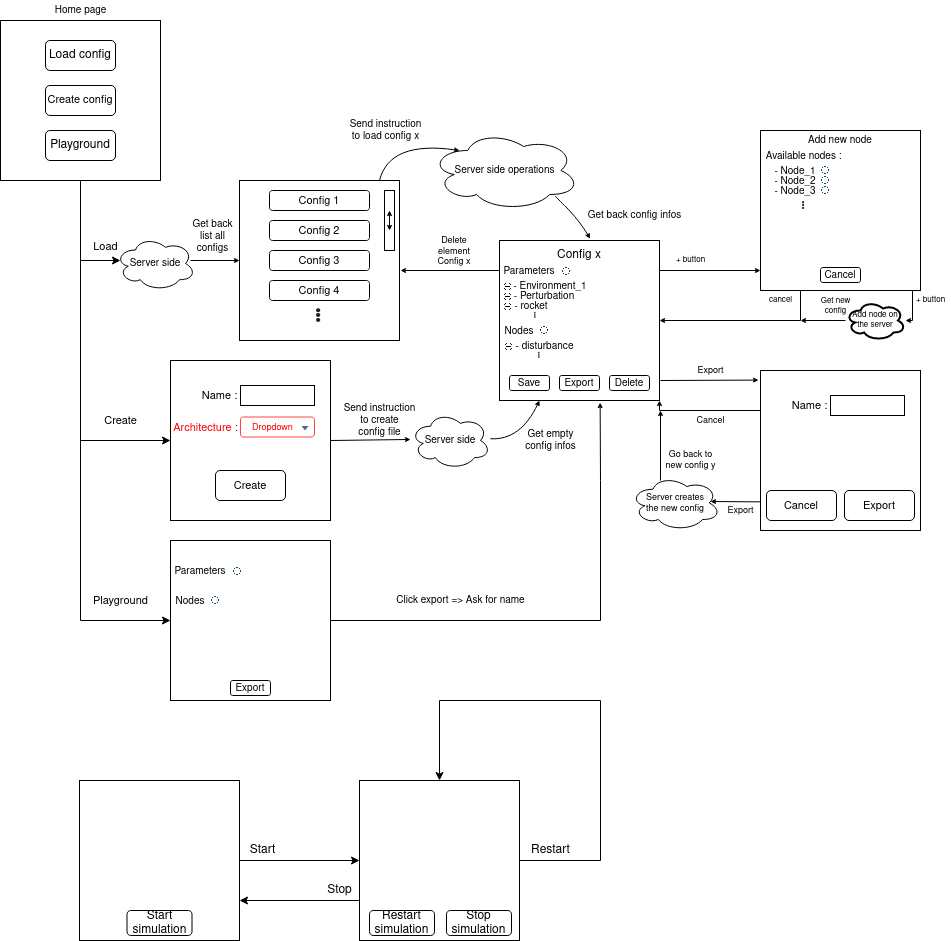

# Using foxglove as User Interface
To be able to use the foxglove, you first have to install it at this link : https://foxglove.dev/

When you lauch the app, you have to choose to which ROS connection you want to connect. Typically to connect to the real_time_simulator, it will be "Open connections" -> "ROS 1" leaving the default values (ROS_MASTER_URI = http://localhost:11311, ROS_HOSTNAME = {your_hostname})

Now that you are connected to your ROS ecosystem, you will need to change the path to ROS so that foxglove knows where to find the ROS packages. To do that, on the foxglove software, there is a small gear at the bottom left of the screen to go to the preferences. Change the ROS_PACKAGE_PATH parameter to your ROS package location. It should look something like /home/{username}/catkin_ws/src

Now, you can install the extension :

If you have access to the .foxe file, unpack it and put it in your ~/.foxglove-studio/extensions folder.

If the extension has been published on the marketplace, install it from there.

Otherwise, follow the "Develop an extension" and "Build project" steps below.

# Develop an extension
You have a tutorial on how to create an extension for foxglove here https://foxglove.dev/docs/studio/extensions/getting-started

You will need to install <a href="https://nodejs.org/en/">Node.js 14+</a> and <a href="">Yarn</a> if you don't already have them 

You will need to create a directory that will contain your extensions,


# Build project
To build the project, you need to go into your extension folder and execute one of the following commands : 

1. This command builds the project but the changes are not visible in foxglove. It tells you if you have syntax errors.
```bash
yarn build
```
2. This command builds the project and pushes the changes to foxglove. To see the changes, you have to restart foxglove.

```bash
yarn local-install
```

# How to communicate with ROS (dev only)

You can find more infos at <a href="https://foxglove.dev/docs/studio/extensions/panel-api-methods">this link</a>.

## Publish on a topic
To advertise on a topic using basic message type : 
``` js
context.advertise?.("/topic", "std_msgs/String", {
      datatypes: new Map(
        Object.entries({
          "std_msgs/String": { definitions: [{ name: "data", type: "string" }] },
        }),
      ),
    });
```
and then publish :

``` js
context.publish?.("/topic", { data: 'value' });
```

To use custom message types, the second argument is {package}/{TypeName}. 

ex:

```js
// Advertise update topic
    context.advertise?.("/updateTopic", "real_time_simulator/Update", {
      datatypes: new Map(
        Object.entries({
          "real_time_simulator/Update": {definitions: [
            { type: "string", name: "config"},
            { type: "string", name: "parameter"},
            { type: "string", name: "value"},
        ]}
        }),
      ),
    });
```

## Subscribe to a topic

To subscribe to a topic and get the messages, you first need to say that you want your layout to update every time you get a message on a topic using this line inside the useLayoutEffect block:

```js
context.watch("currentFrame");
```

Then, you need to subscribe to the topics using this line :

```js
context.subscribe(["/topic1", "/topic2", ...]);
```

Calling subscribe with no topics will unsubscribe from all topics.

After that, all messages from all topics subsribed that are recieved will be availaibe during one refresh in this variable :

```js
renderState.currentFrame
```

# Plan

